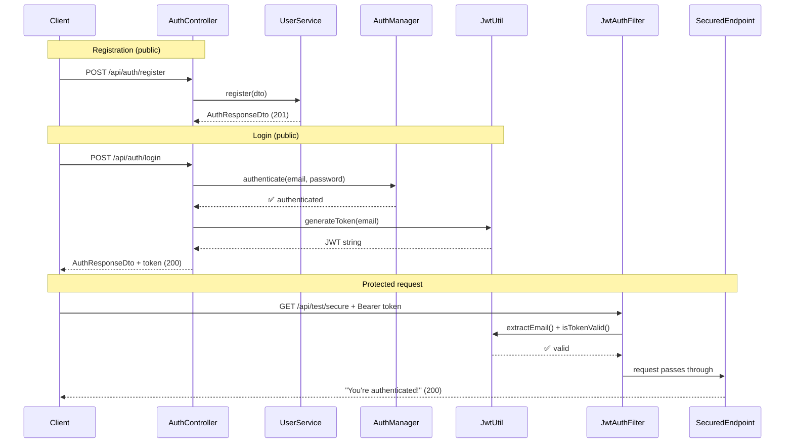

# PayDost — JWT Authentication Added ✅

**Build Status:** ✅ `BUILD SUCCESS` — 15 source files, zero errors

---

## Final Folder Structure

```
paydost/src/main/java/com/example/paydost/
├── PayDostApplication.java
├── config/
│   └── SecurityConfig.java              ← REWRITTEN: JWT filter chain
├── controller/
│   ├── AuthController.java              ← UPDATED: + POST /api/auth/login
│   └── TestController.java              ← NEW: GET /api/test/secure (protected)
├── dto/
│   ├── AuthResponseDto.java             ← UPDATED: + token field
│   ├── LoginRequestDto.java             ← NEW
│   └── RegisterRequestDto.java
├── exception/
│   ├── GlobalExceptionHandler.java      ← UPDATED: + BadCredentials 401
│   └── UserAlreadyExistsException.java
├── model/
│   └── User.java
├── repository/
│   └── UserRepository.java
├── security/                            ← NEW PACKAGE
│   ├── CustomUserDetailsService.java    ← NEW: loads User → UserDetails
│   ├── JwtAuthFilter.java              ← NEW: OncePerRequestFilter
│   └── JwtUtil.java                    ← NEW: generate/validate tokens
└── service/
    └── UserService.java
```

---

## What Changed

| Action | File | Summary |
|--------|------|---------|
| **Modified** | [pom.xml](file:///d:/SpringBoot%20Projects/paydost/pom.xml) | Added `jjwt-api`, `jjwt-impl`, `jjwt-jackson` v0.12.6 |
| **Modified** | [application.properties](file:///d:/SpringBoot%20Projects/paydost/src/main/resources/application.properties) | Added `app.jwt.secret` (Base64 placeholder) + `app.jwt.expiration` (24h) |
| **New** | [JwtUtil.java](file:///d:/SpringBoot%20Projects/paydost/src/main/java/com/example/paydost/security/JwtUtil.java) | `generateToken()`, `extractEmail()`, `isTokenValid()` |
| **New** | [CustomUserDetailsService.java](file:///d:/SpringBoot%20Projects/paydost/src/main/java/com/example/paydost/security/CustomUserDetailsService.java) | Loads user by email → Spring Security `UserDetails` |
| **New** | [JwtAuthFilter.java](file:///d:/SpringBoot%20Projects/paydost/src/main/java/com/example/paydost/security/JwtAuthFilter.java) | Extracts Bearer token, validates, sets `SecurityContext`. Skips `/api/auth/**` |
| **Rewritten** | [SecurityConfig.java](file:///d:/SpringBoot%20Projects/paydost/src/main/java/com/example/paydost/config/SecurityConfig.java) | CSRF off, `/api/auth/**` public, all else authenticated, STATELESS sessions, JWT filter registered |
| **New** | [LoginRequestDto.java](file:///d:/SpringBoot%20Projects/paydost/src/main/java/com/example/paydost/dto/LoginRequestDto.java) | email + password with validation |
| **Modified** | [AuthResponseDto.java](file:///d:/SpringBoot%20Projects/paydost/src/main/java/com/example/paydost/dto/AuthResponseDto.java) | Added `token` field |
| **Updated** | [AuthController.java](file:///d:/SpringBoot%20Projects/paydost/src/main/java/com/example/paydost/controller/AuthController.java) | Added `POST /api/auth/login` endpoint |
| **New** | [TestController.java](file:///d:/SpringBoot%20Projects/paydost/src/main/java/com/example/paydost/controller/TestController.java) | `GET /api/test/secure` → "You're authenticated!" |
| **Updated** | [GlobalExceptionHandler.java](file:///d:/SpringBoot%20Projects/paydost/src/main/java/com/example/paydost/exception/GlobalExceptionHandler.java) | Added `BadCredentialsException` → 401 handler |

---

## Architecture Flow



---

## Testing with curl / Postman

### 1️⃣ Register a new user
```bash
curl -X POST http://localhost:8080/api/auth/register \
  -H "Content-Type: application/json" \
  -d '{"fullName":"Vansh","email":"vansh@example.com","password":"secret123"}'
```
**Expected → 201:**
```json
{"message": "User registered successfully", "email": "vansh@example.com", "token": null}
```

### 2️⃣ Login and get JWT token
```bash
curl -X POST http://localhost:8080/api/auth/login \
  -H "Content-Type: application/json" \
  -d '{"email":"vansh@example.com","password":"secret123"}'
```
**Expected → 200:**
```json
{
  "message": "Login successful",
  "email": "vansh@example.com",
  "token": "eyJhbGciOiJIUzM4NCJ9.eyJzdWIiOiJ2YW5zaEBleGFtcGxlLmNvbSIs..."
}
```

### 3️⃣ Call protected endpoint WITH token ✅
```bash
curl http://localhost:8080/api/test/secure \
  -H "Authorization: Bearer <paste-token-from-step-2>"
```
**Expected → 200:**
```
You're authenticated!
```

### 4️⃣ Call protected endpoint WITHOUT token ❌
```bash
curl http://localhost:8080/api/test/secure
```
**Expected → 403 Forbidden**

### 5️⃣ Login with wrong password ❌
```bash
curl -X POST http://localhost:8080/api/auth/login \
  -H "Content-Type: application/json" \
  -d '{"email":"vansh@example.com","password":"wrongpassword"}'
```
**Expected → 401:**
```json
{"timestamp": "...", "status": 401, "error": "Unauthorized", "message": "Invalid email or password"}
```

---

> [!IMPORTANT]
> The `app.jwt.secret` in [application.properties](file:///d:/SpringBoot%20Projects/paydost/src/main/resources/application.properties) is a placeholder Base64 string. **Replace it with a strong, random secret before going to production** (or set the `JWT_SECRET` environment variable).
